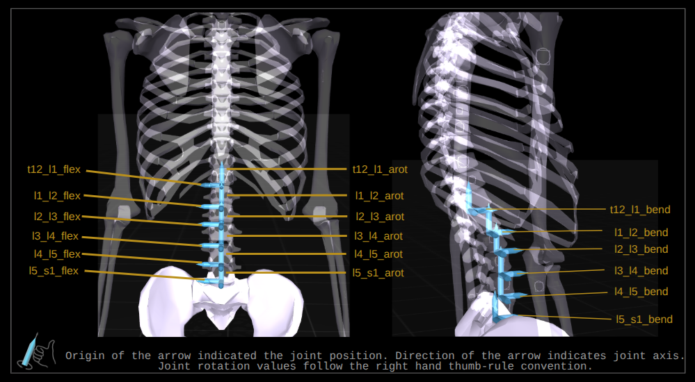
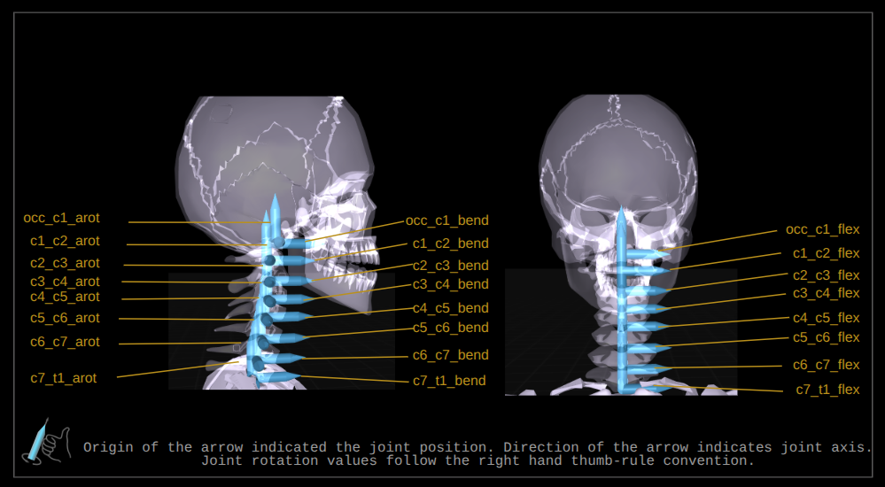
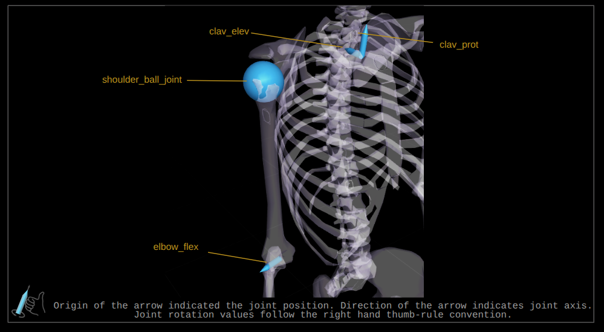
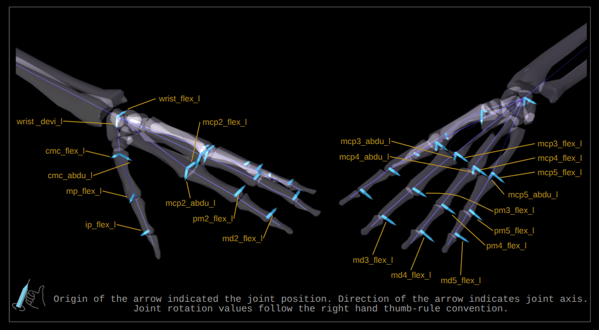
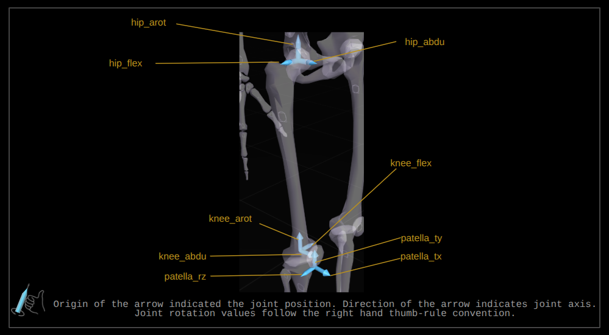
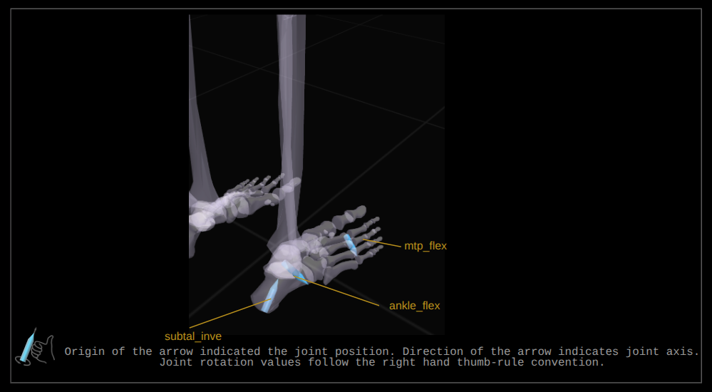

# Model overview
Here we describe the anatomical joints included in the MyoSkeleton model, the naming convention and joint organization, as well as the sign convention for the joints in the model.


## Joint Hierarchy

<details>
<summary>View hierarchy</summary>

The MyoSkeleton model follows a hierarchical tree structure, where each joint connects a child body to its parent body. The hierarchy starts from the root (pelvis) and branches out to the extremities.

```
ROOT (pelvis)
├── SPINE
│   ├── l5_s1 → l4_l5 → l3_l4 → l2_l3 → l1_l2 → t12_l1
│   └── NECK
│       └── c7_t1 → c6_c7 → c5_c6 → c4_c5 → c3_c4 → c2_c3 → c1_c2 → occ_c1 (skull)
│
├── ARMS (Right & Left)
│   ├── clavicle (clav_prot, clav_elev)
│   ├── shoulder
│   ├── elbow
│   └── HANDS
│       ├── wrist (wrist_pron, wrist_devi, wrist_flex)
│       └── FINGERS
│           ├── thumb (cmc, mp, ip)
│           ├── index (mcp2, pm2, md2)
│           ├── middle (mcp3, pm3, md3)
│           ├── ring (mcp4, pm4, md4)
│           └── pinky (mcp5, pm5, md5)
│
└── LEGS (Right & Left)
    ├── hip (hip_flex, hip_abdu, hip_arot)
    ├── knee (tibia_tx, tibia_ty, knee_flex, knee_abdu, knee_arot)
    │   └── patella (patella_ty, patella_tx, patella_rz)
    └── FEET
        ├── ankle (ankle_flex)
        ├── subtalar (subtal_inve)
        └── metatarsophalangeal (mtp_flex)
```

</details>

## Motion Types
### Rotational joints
The modeled joints cover different types of rotational motion based on anatomical descriptions.
These use the keywords - flex, arot, bend, pron, devi, abdu and inve.
General (non-anatomical) rotations use rx, ry, rz to denote rotations about the x, y and z axes of the parent body.

<details>
<summary>
Three common rotational motions - Flexion/Extension, Axial Rotation, Lateral Bending
</summary>

### Flexion/Extension

- **Keyword:** `flex` (e.g., `elbow_flex`, `knee_flex`, `ankle_flex`)
- **Plane of motion:** Sagittal (side-on view)
- **Sign Convention:**
  - **Positive (+):** Flexion brings two bones together
  - **Negative (−):** Extension moves bones apart

### Axial Rotation

- **Keyword:** `arot` (e.g., `hip_arot`, `l5_s1_arot`)
- **Plane of motion:** Transverse (top-down view)
- **Sign Convention:**
  - **Positive (+):** Counterclockwise rotation - viewed from above
  - **Negative (−):** Clockwise rotation - viewed from above

### Lateral Bending

- **Keyword:** `bend` (e.g., `l5_s1_bend`, `c7_t1_bend`)
- **Plane of motion:** Frontal (front-on view)
- **Sign Convention:**
  - **Positive (+):** Counterclockwise bending - viewed from the front
  - **Negative (−):** Clockwise bending - viewed from the front
</details>

<details>
<summary>
Uncommon rotational motions - Pronation/Supination, Protraction/Retraction, Deviation, Abduction/Adduction, Inversion/Eversion
</summary>

### Pronation/Supination

- **Keyword:** `pron` (e.g., `wrist_pron`)
- **Plane of motion:** Transverse (top-down view)
- **Sign Convention:**
  - **Positive (+):** Pronation (hand palm-side down)
  - **Negative (−):** Supination (hand palm-side up)

### Protraction/Retraction

- **Keyword:** `prot` (e.g., `clav_prot`)
- **Plane of motion:** Transverse (top-down view)
- **Sign Convention:**
  - **Positive (+):** Away from the body
  - **Negative (−):** Towards the body

### Deviation

- **Keyword:** `devi` (e.g., `wrist_devi`)
- **Plane of motion:** Frontal (front-on view)
- **Sign Convention:**
  - **Positive (+):** Towards the radius
  - **Negative (−):** Towards the ulna

### Abduction/Adduction

- **Keyword:** `abdu` (e.g., `cmc_abdu`)
- **Plane of motion:** Frontal (front-on view)
- **Sign Convention:**
  - **Positive (+):** Abduction (bone moves away from body)
  - **Negative (−):** Adduction (bone moves toward body)

### Inversion/Eversion

- **Keyword:** `inve` (e.g., `subtal_inve`)
- **Plane of motion:** Frontal (front-on view)
- **Sign Convention:**
  - **Positive (+):** Inversion (bone moves toward body centerline)
  - **Negative (−):** Eversion (bone moves away from centerline)
</details>

### Translational joints
Some joints couple rotation with translation. We mark translational degrees of freedom as tx, ty or tz to denote translations along the x, y and z axes of the parent body.
<details>
<summary>
Tibial translation
</summary>
We use a knee model with combined rotational and translation degrees of freedom https://doi.org/10.1016/0021-9290(88)90135-2
</details>

<details>
<summary>
Patellar translation
</summary>
The patella translates along the trochlear groove and rotates as the knee moves.
</details>

### Quaternion joints
The motion of the pelvis in space is described using a free-joint: a combination of three translations freedoms and a quaternion.

The shoulder is treated as a ball-joint and thus described using a quaternion.

## Joint Groupings

> Naming convention: `*_r (_l)` indicates a right-side joint with a symmetric left counterpart.

### ROOT
<details>
<summary>View joints</summary>

| BodyName | JointName |
|---------|----------|
| ROOT | myoskeleton_root |

</details>

### SPINE


<details>
<summary>View joints</summary>

| BodyName | JointName |
|---------|----------|
| SPINE | l5_s1_flex |
| SPINE | l5_s1_bend |
| SPINE | l5_s1_arot |
| SPINE | l4_l5_flex |
| SPINE | l4_l5_bend |
| SPINE | l4_l5_arot |
| SPINE | l3_l4_flex |
| SPINE | l3_l4_bend |
| SPINE | l3_l4_arot |
| SPINE | l2_l3_flex |
| SPINE | l2_l3_bend |
| SPINE | l2_l3_arot |
| SPINE | l1_l2_flex |
| SPINE | l1_l2_bend |
| SPINE | l1_l2_arot |
| SPINE | t12_l1_flex |
| SPINE | t12_l1_bend |
| SPINE | t12_l1_arot |

</details>

### NECK

<details>
<summary>View joints</summary>

| BodyName | JointName |
|---------|----------|
| NECK | c7_t1_flex |
| NECK | c7_t1_bend |
| NECK | c7_t1_arot |
| NECK | c6_c7_flex |
| NECK | c6_c7_bend |
| NECK | c6_c7_arot |
| NECK | c5_c6_flex |
| NECK | c5_c6_bend |
| NECK | c5_c6_arot |
| NECK | c4_c5_flex |
| NECK | c4_c5_bend |
| NECK | c4_c5_arot |
| NECK | c3_c4_flex |
| NECK | c3_c4_bend |
| NECK | c3_c4_arot |
| NECK | c2_c3_flex |
| NECK | c2_c3_bend |
| NECK | c2_c3_arot |
| NECK | c1_c2_flex |
| NECK | c1_c2_bend |
| NECK | c1_c2_arot |
| NECK | occ_c1_flex |
| NECK | occ_c1_bend |
| NECK | occ_c1_arot |

</details>

### ARMS

<details>
<summary>View joints</summary>

| BodyName | JointName |
|---------|----------|
| ARMS | clav_prot_r (_l) |
| ARMS | clav_elev_r (_l) |
| ARMS | shoulder_r (_l) |
| ARMS | elbow_flex_r (_l) |

</details>

### HANDS (WRIST + FINGERS)

<details>
<summary>View joints</summary>

| BodyName | JointName |
|---------|----------|
| HANDS | wrist_pron_r (_l) |
| HANDS | wrist_devi_r (_l) |
| HANDS | wrist_flex_r (_l) |
| FINGERS | cmc_flex_r (_l) |
| FINGERS | cmc_abdu_r (_l) |
| FINGERS | mp_flex_r (_l) |
| FINGERS | ip_flex_r (_l) |
| FINGERS | mcp2_flex_r (_l) |
| FINGERS | mcp2_abdu_r (_l) |
| FINGERS | pm2_flex_r (_l) |
| FINGERS | md2_flex_r (_l) |
| FINGERS | mcp3_flex_r (_l) |
| FINGERS | mcp3_abdu_r (_l) |
| FINGERS | pm3_flex_r (_l) |
| FINGERS | md3_flex_r (_l) |
| FINGERS | mcp4_flex_r (_l) |
| FINGERS | mcp4_abdu_r (_l) |
| FINGERS | pm4_flex_r (_l) |
| FINGERS | md4_flex_r (_l) |
| FINGERS | mcp5_flex_r (_l) |
| FINGERS | mcp5_abdu_r (_l) |
| FINGERS | pm5_flex_r (_l) |
| FINGERS | md5_flex_r (_l) |

</details>

### LEGS

<details>
<summary>View joints</summary>

| BodyName | JointName |
|---------|----------|
| LEGS | hip_flex_r (_l) |
| LEGS | hip_abdu_r (_l) |
| LEGS | hip_arot_r (_l) |
| LEGS | tibia_tx_r (_l) |
| LEGS | tibia_ty_r (_l) |
| LEGS | knee_flex_r (_l) |
| LEGS | knee_abdu_r (_l) |
| LEGS | knee_arot_r (_l) |
| LEGS | patella_ty_r (_l) |
| LEGS | patella_tx_r (_l) |
| LEGS | patella_rz_r (_l) |

</details>

### FEET

<details>
<summary>View joints</summary>

| BodyName | JointName |
|---------|----------|
| FEET | ankle_flex_r (_l) |
| FEET | subtal_inve_r (_l) |
| FEET | mtp_flex_r (_l) |

</details>
